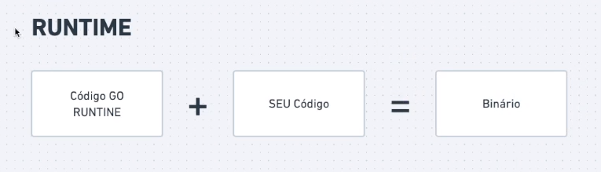

# Compilando e Colocando em Produção Aplicativos em Go



## Compilação de Projeto Go

Compilar um projeto Go é um processo direto. Siga estes passos simples:

1. **Escreva seu Código:**  
   Comece escrevendo seu código Go em um arquivo com a extensão `.go`, como por exemplo `main.go`.

2. **Navegue até o Diretório do Projeto:**  
   Abra um terminal e navegue até o diretório onde está localizado seu arquivo `main.go`.

3. **Compile o Código:**  
   A maneira de compilar pode variar de acordo com o sistema operacional:

   - **Linux:**  
     Utilize o comando `go build` seguido do nome do arquivo que contém o código principal:
     ```bash
     GOOS=linux go build main.go
     ```  
     Isso criará um arquivo executável no mesmo diretório.

   - **macOS:**  
     Utilize o comando `go build` seguido do nome do arquivo que contém o código principal:
     ```bash
     GOOS=darwin go build main.go
     ```  
     Isso criará um arquivo executável no mesmo diretório.

   - **Windows:**  
     Use o mesmo comando `go build`, mas o arquivo executável resultante terá extensão `.exe`. Por exemplo:
     ```bash
     GOOS=windows go build main.go
     ```  
     Isso criará um arquivo `main.exe` executável no mesmo diretório.

## Implantação em Produção

Uma vez compilado, você pode colocar seu aplicativo em produção seguindo estas etapas:

1. **Preparação do Ambiente de Produção:**  
   Certifique-se de configurar corretamente seu ambiente de produção, incluindo variáveis de ambiente necessárias e configurações específicas do sistema.

2. **Implantação do Aplicativo:**  

   - **Linux e macOS:**  
     Copie o arquivo executável gerado durante a compilação para o local desejado em seu ambiente de produção. No Linux e macOS, utilize o terminal e o comando `cp`. Por exemplo:
     ```bash
     cp main /caminho/do/seu/projeto
     ```

   - **Windows:**  
     No Windows, utilize o Explorador de Arquivos para copiar o arquivo executável (`main.exe`) para o local desejado em seu ambiente de produção.

3. **Execução do Aplicativo:**  

   - **Linux e macOS:**  
     Execute o aplicativo no ambiente de produção utilizando o terminal. Navegue até o diretório onde seu aplicativo está localizado e execute-o. Por exemplo:
     ```bash
     ./main
     ```

   - **Windows:**  
     No Windows, navegue até o diretório onde seu aplicativo está localizado utilizando o Explorador de Arquivos. Em seguida, clique duas vezes no arquivo executável (`main.exe`) para executá-lo.

Agora seu aplicativo Go está em produção e pronto para ser utilizado!
